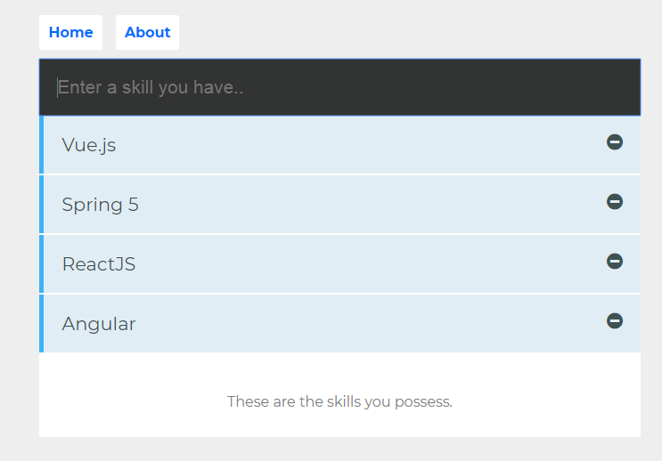

# vue-learning-app

Vue Crash Course Learning Lessons

* Step 1 : Completed the Udemy [Vue 2 Crash course](https://www.udemy.com/vue-2-crash-course/learn/v4/overview)

  * TODO
    * Fix the IE polyfill issue

* Step 2 : Create a complete shopping cart app with the works (vuex, material-ui, pwa , authentication etc.)  

